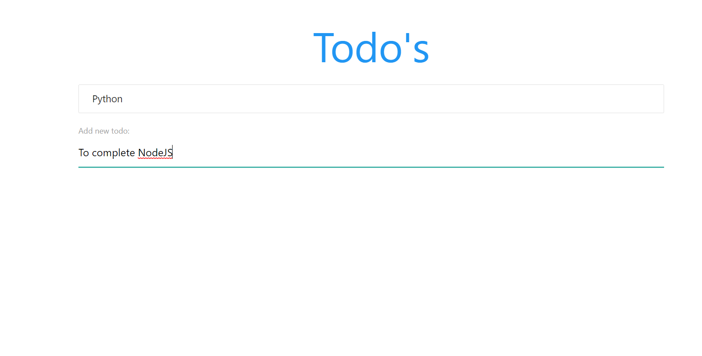
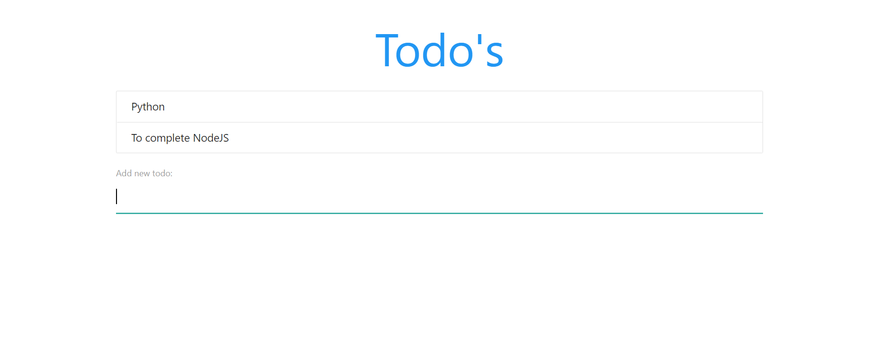

# ToDoApp

This project is created using reactjs and this is a todo project it means we can take or keep notes through this.
By clicking on the notes it will be deleted.

Link to the app: [ToDoApp](https://keep-note-details.herokuapp.com/)

# To start this project follow below instructions - 
1. Clone the repo (https://github.com/Monukr14/ToDoApp-Using-ReactJs.git)
2. Enter into the project (cd Covid-19-Dashboard)
3. Install dependencies (npm install)
4. Run the project (npm start)
